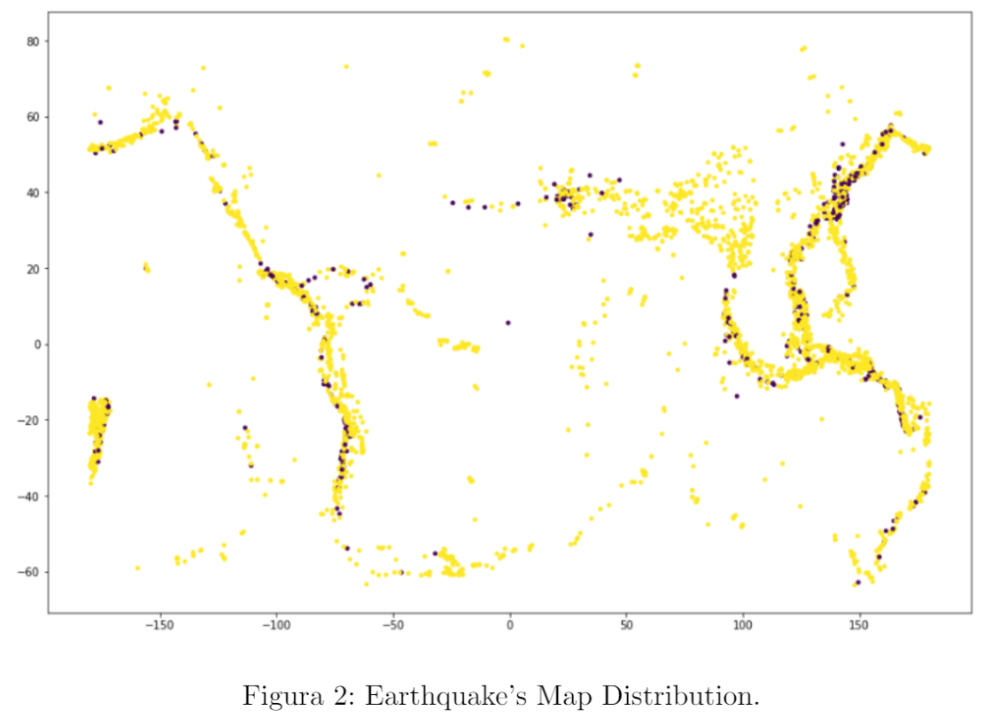

# Minería de Datos - Proyecto semestral

Alumnos: 
- Gregory Schuit
- Luciano Davico

En este repositorio se encuentra el análisis experimental sobre cómo es posible clasificar terremotos de acuerdo si estos causan o no un tsunami. Para este proyecto se fusionaron dos _datasets_, uno de terremotos y otro de tsunamis, y se procedió a visualizar los datos y a procesarlos mediante técnicas como Random Forest y Perceptrón Multicapa.

Algunos problemas que se tratan de solucionar en este trabajo están principalmente relacionados con un gran desbalance de los datos, debido a una excesiva cantidad de terremotos y pocos tsunamis, y con la poca información geológica que se le entrega al algoritmo.

 

